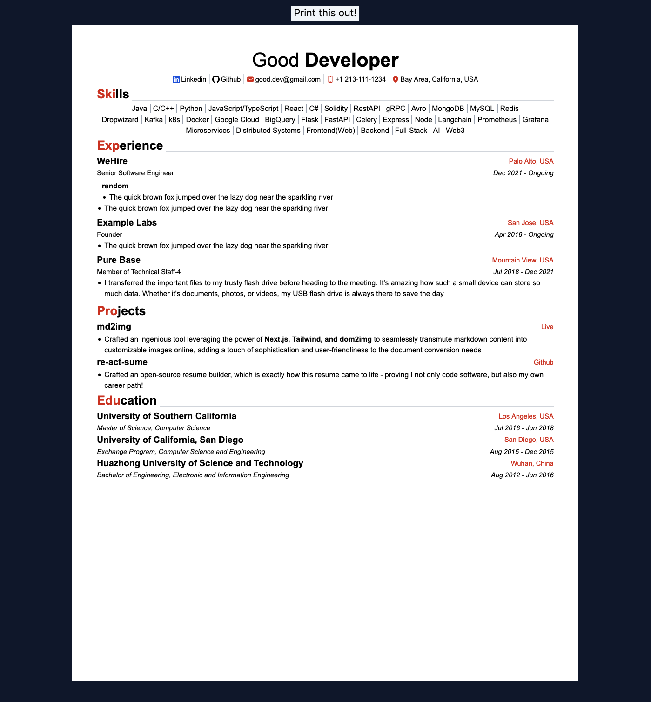

# simple-resume

A simple template to build a simple, clean yet individualistic resume!

## Usage

```bash
git clone https://github.com/lXXXw/simple-resume.git
cd simple-resume/resume
npm install
npm run dev
```

Navigate in your browser to http://localhost:3000/ to check the example!

Click the button to download the PDF version *(Firefox recommended for best copy-paste experience)*

## Screenshot




## Resume content

1. Copy `resume/src/content/example.js` and save it as `resume/src/content/<your_name>.js` and modify the json object to meet your needs!
2. Open `resume/src/components/main/main.js` and change this `import { content } from "../../content/example";` to `import { content } from "../../content/<your_name>";`


## Config

`resume/tailwind.config.js`

### Accent Color

```javascript
      colors: {
        "accent-color": "#c93120",  // change to what you like!
      },
```

### Font Family

```javascript
    fontFamily: {
      sans: ["Arial"],
    },
```

### Font Size

```javascript
    fontSize: {
      xs: "0.68rem",
      sm: "0.73rem",
      base: "0.90rem",
      xl: "1.25rem",
      "2xl": "1.563rem",
      "3xl": "1.953rem",
      "4xl": "2.441rem",
      "5xl": "3.052rem",
    },
```

More configs coming soon!